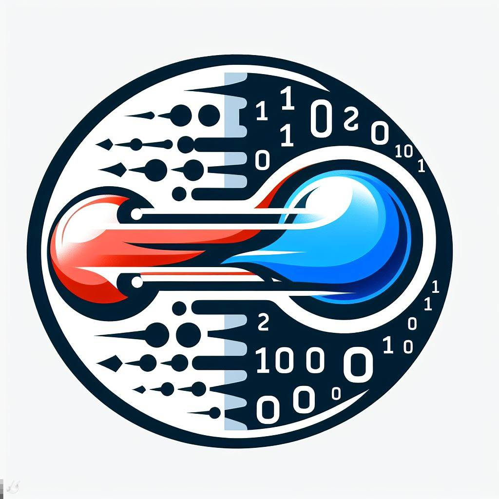

# MedVoxelHD

<h1>  MedVoxelHD </h1>

raw=true

CUDA c++ pytorch extension for mathemathical morphology based Hausdorff distance. Repository contain dockerfile, enviroment can be also created more conviniently with vscode remote development containers using files in this repository.

## Prerequisites
In order to build docker container one need to have NVIDIA GPU hardware and NVIDIA Container Toolkit installed [link](https://docs.nvidia.com/datacenter/cloud-native/container-toolkit/latest/install-guide.html). As the dockerfile will download also sample data it is advised to have at least 30gb of space available on the disk.

## Installation
First one need to build docker container. Easiest way to execute the code is to 
1) clone the repository
2) install NVIDIA Container Toolkit if not already done [link](https://docs.nvidia.com/datacenter/cloud-native/container-toolkit/latest/install-guide.html)
3) open the folder with repository using visual studio code
4) install remote development extension in vs code
5) click remote explorer next click plus at the top left and open in remote container
6) the rest of the configuration should happen automatically
 
## Usage

In order to execute the code using Python and PyTorch the python file need to be able to localize the lltm_cuda.cpp and lltm_cuda_kernel.cu files. The easiest ways to achieve it is via locating the python file in the same directory as the 2 files mentioned.
In the python file the extension needs to be first loaded. For example :
```
from torch.utils.cpp_extension import load
lltm_cuda = load('lltm_cuda', ['lltm_cuda.cpp', 'lltm_cuda_kernel.cu'], verbose=True)
```
There are couple ways how to execute computations of the Hausdorff distance. The most basic one return just a single number. For example :
```
lltm_cuda.getHausdorffDistance(a[0,0,:,:,:], b[0,0,:,:,:],  WIDTH,  HEIGHT,  DEPTH,0.90, torch.ones(1, dtype =bool) )
where first two entries are 3 dimensional boolean cuda pytorch tensors, that has the same shape.  WIDTH,  HEIGHT,  DEPTH Indicate the shape of a input tensor, next is the robustness percent telling how much of the points are analyzed if set to 0.9 as above 10% of the points that are most distant from other mask will be ignored, the last entry indicates wheather we are looking for True or False voxels in most cases best to set as in example above
```
Additionally we have two additional functions with the same arguments:
1) getHausdorffDistance_FullResList will give all of the distances between two masks so for example histogram can be created from this
2) getHausdorffDistance_3Dres will return 3 dimensional array indicating what is the contribution of each voxel to the overall HD distance. It makes easy to visualize where areas that are most problematic in segmentation are present.

## Example
Example and more detailed explanation of the algorithm is in the documentation
